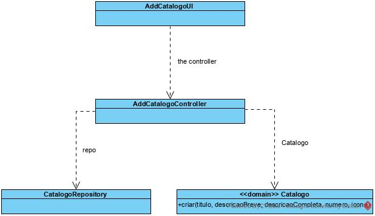

# Adicionar Catalogo
=======================================

# 1. Requisitos

**Demo1**
Como Gestor de Serviços de Help desk (GSH), eu pretendo criar um novo catálogo de serviços.

Demo1.1. Adicionar catálogo

Demo1.2. Editar catálogo

Demo1.3. Remover catálogo

A interpretação feita deste requisito foi no sentido de criar uma forma de carregar para a base de dados a informação dos catálogos. Para além disso, também é possível editar os seus dados e remover um catálogo, bem como consultar a informação sempre que necessário.

# 2. Análise

*Neste secção a equipa deve relatar o estudo/análise/comparação que fez com o intuito de tomar as melhores opções de design para a funcionalidade bem como aplicar diagramas/artefactos de análise adequados.*

*Recomenda-se que organize este conteúdo por subsecções.*

# 3. Design

A forma encontrada para resolver este problema foi criar uma classe AdicionarCatalogoUI que faz uso do AdicionarCatalogoController para criar instâncias de forma a garantir as regras de negócio dadas pelo cliente.

## 3.1. Realização da Funcionalidade

## 3.2. Diagrama de Classes

## 3.4. Testes 
*Nesta secção deve sistematizar como os testes foram concebidos para permitir uma correta aferição da satisfação dos requisitos.*

**Teste 1:** Verificar que não é possível criar uma instância da classe Exemplo com valores nulos.

	@Test(expected = IllegalArgumentException.class)
		public void ensureNullIsNotAllowed() {
		Exemplo instance = new Exemplo(null, null);
	}

# 4. Implementação

*Nesta secção a equipa deve providenciar, se necessário, algumas evidências de que a implementação está em conformidade com o design efetuado. Para além disso, deve mencionar/descrever a existência de outros ficheiros (e.g. de configuração) relevantes e destacar commits relevantes;*

*Recomenda-se que organize este conteúdo por subsecções.*

# 5. Integração/Demonstração

*Nesta secção a equipa deve descrever os esforços realizados no sentido de integrar a funcionalidade desenvolvida com as restantes funcionalidades do sistema.*

# 6. Observações

*Nesta secção sugere-se que a equipa apresente uma perspetiva critica sobre o trabalho desenvolvido apontando, por exemplo, outras alternativas e ou trabalhos futuros relacionados.*

