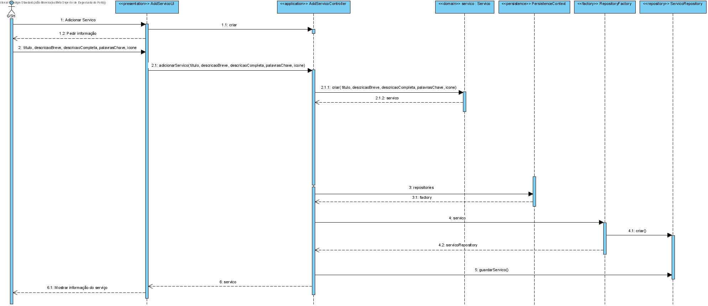
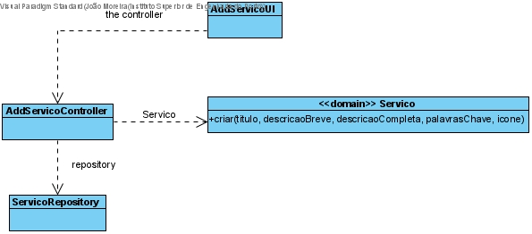

# Especificar um Serviço
=======================================

# 1. Requisitos
**Demo1** 
Como Gestor de Serviços de HelpDesk (GSH), eu pretendo proceder à especificação de um novo serviço.

Demo1.1. Adicionar Serviço

Demo1.2. Editar Serviço

Demo1.3 Remover Serviço

A interpretação feita deste requisito foi no sentido de criar uma forma de carregar para a base de dados a informação dos serviços criados. Para além disso, também é possível editar os seus dados e desativar os mesmos quando deixam de ser necessários.

# 2. Análise

Enquanto é desenvolvido o programa é de interesse que não se tenha de inserir informação na base de dados de cada vez que o programa precisa ser testado. Sendo assim, faz-se bootstrap de serviços de forma a agilizar e a rentabilizar melhor o tempo da equipa no desenvolvimento do software.

# 3. Design

A forma encontrada para resolver este problema foi criar uma classe AdicionarServiçoUI que faz uso do AdicionarServicoController para criar instâncias de forma a garantir as regras de negócio dadas pelo cliente.

## 3.1. Realização da Funcionalidade

## 3.2. Diagrama de Classes

