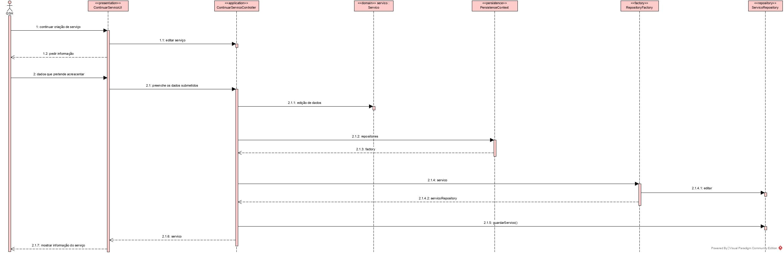
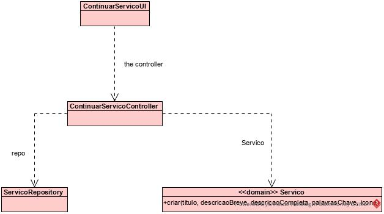

# Continuar/completar a especificação em curso de um serviço.
=======================================

# 1. Requisitos

**Demo1** 
Como GSH, eu pretendo continuar/completar a especificação em curso de um serviço.

A interpretação feita deste requisito foi no sentido de criar uma forma de completar a especificação de um serviço já iniciado, fazendo com que o mesmo só fique disponível depois de ter todos os campos devidamente preenchidos.

# 2. Análise

Com o intuito de facilitar e ajudar o colaborador são mostrados todos os serviços inacabados para que ele possa escolher aquele a que pretende acrescentar informação, ou até mesmo acabá-lo.

# 3. Design

A forma encontrada para resolver este problema foi criar uma classe ContinuarServicoUI que faz uso do EditarServicoController para acabar ou apenas adicionar informação a um serviço que ainda não está completo.

## 3.1. Realização da Funcionalidade

## 3.2. Diagrama de Classes

## 3.4. Testes 
*Nesta secção deve sistematizar como os testes foram concebidos para permitir uma correta aferição da satisfação dos requisitos.*

**Teste 1:** Verificar que não é possível criar uma instância da classe Exemplo com valores nulos.

	@Test(expected = IllegalArgumentException.class)
		public void ensureNullIsNotAllowed() {
		Exemplo instance = new Exemplo(null, null);
	}

# 4. Implementação

*Nesta secção a equipa deve providenciar, se necessário, algumas evidências de que a implementação está em conformidade com o design efetuado. Para além disso, deve mencionar/descrever a existência de outros ficheiros (e.g. de configuração) relevantes e destacar commits relevantes;*

*Recomenda-se que organize este conteúdo por subsecções.*

# 5. Integração/Demonstração

*Nesta secção a equipa deve descrever os esforços realizados no sentido de integrar a funcionalidade desenvolvida com as restantes funcionalidades do sistema.*

# 6. Observações

*Nesta secção sugere-se que a equipa apresente uma perspetiva critica sobre o trabalho desenvolvido apontando, por exemplo, outras alternativas e ou trabalhos futuros relacionados.*

