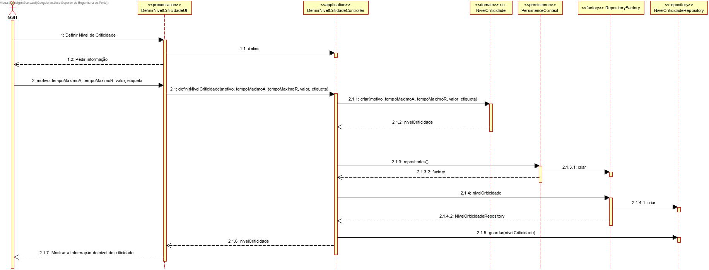
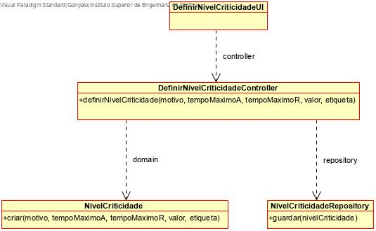

# Definir Nivel de Criticidade
=======================================

# 1. Requisitos

**Demo1**
Como Gestor de Serviços de Help desk (GSH), eu pretendo proceder à definição de um novo nível de criticidade de modo a que este possa, posteriormente, caraterizar um catálogo, serviço ou tarefa

Demo1.1. Definir nivel de criticididade

A interpretação feita deste requisito foi no sentido de criar uma forma de carregar para a base de dados a informação dos níveis de criticidade. 

# 2. Análise

Enquanto é desenvolvido o programa é de interesse que não se tenha de inserir informação na base de dados de cada vez que o programa precisa ser testado. Sendo assim, faz-se bootstrap de níveis de criticidade de forma a agilizar e a rentabilizar melhor o tempo da equipa no desenvolvimento do software.

# 3. Design

A forma encontrada para resolver este problema foi criar uma classe AdicionarColaboradorUI que faz uso do AdicionarColaboradorController para criar instâncias de forma a garantir as regras de negócio dadas pelo cliente.

## 3.1. Realização da Funcionalidade

## 3.2. Diagrama de Classes

# 3. Design

A forma encontrada para resolver este problema foi criar uma classe DefinirNivelCriticidadeUI que faz uso do DefinirNivelCriticidadeController para criar instâncias de forma a garantir as regras de negócio dadas pelo cliente.

## 3.1. Realização da Funcionalidade

## 3.2. Diagrama de Classes

## 3.4. Testes 
*Nesta secção deve sistematizar como os testes foram concebidos para permitir uma correta aferição da satisfação dos requisitos.*

**Teste 1:** Verificar que não é possível criar uma instância da classe Exemplo com valores nulos.

	@Test(expected = IllegalArgumentException.class)
		public void ensureNullIsNotAllowed() {
		Exemplo instance = new Exemplo(null, null);
	}

# 4. Implementação

*Nesta secção a equipa deve providenciar, se necessário, algumas evidências de que a implementação está em conformidade com o design efetuado. Para além disso, deve mencionar/descrever a existência de outros ficheiros (e.g. de configuração) relevantes e destacar commits relevantes;*

*Recomenda-se que organize este conteúdo por subsecções.*

# 5. Integração/Demonstração

*Nesta secção a equipa deve descrever os esforços realizados no sentido de integrar a funcionalidade desenvolvida com as restantes funcionalidades do sistema.*

# 6. Observações

*Nesta secção sugere-se que a equipa apresente uma perspetiva critica sobre o trabalho desenvolvido apontando, por exemplo, outras alternativas e ou trabalhos futuros relacionados.*

