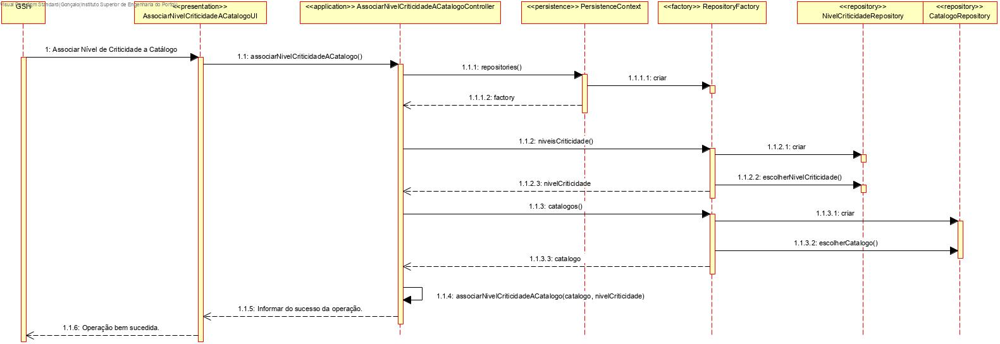
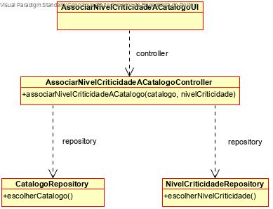

# Associar Nível de Criticidade a Catálogo
=======================================

# 1. Requisitos

**Demo1**
Como Gestor de Serviços de Helpdesk (GSH), eu pretendo proceder à associação de um nível de criticidade a um catálogo.

Demo1.1. Associar nível de criticidade a catálogo

Demo1.2. Remover nível de criticidade de catálogo

A interpretação feita deste requisito foi no sentido de criar uma forma de carregar para a base de dados a associação entre um nível de criticidade e um catálogo, de forma a determinar os requisitos a cumprir aquando a resolução de um determinado serviço de um catálogo. Para além disso, também é possível remover um nível de criticidade de um catálogo.

# 2. Análise

Enquanto é desenvolvido o programa é de interesse que não se tenha de inserir informação na base de dados de cada vez que o programa precisa ser testado. Sendo assim, faz-se bootstrap de colaboradores e de equipas de forma a agilizar e a rentabilizar melhor o tempo da equipa no desenvolvimento do software.

# 3. Design

A forma encontrada para resolver este problema foi criar uma classe AssociarNivelCriticidadeACatalogoUI que faz uso do AssociarNivelCriticidadeACatalogoController para criar instâncias de forma a garantir as regras de negócio dadas pelo cliente.

## 3.1. Realização da Funcionalidade

## 3.2. Diagrama de Classes

## 3.4. Testes 

	@Test
		public void associarNivelCriticidadeACatalogo(){
			Catalogo c = new Catalogo("titulo", "descricaobreve", "descricao detalhada", 5, "gjldg.jpg");
			NivelCriticidade nc = new NivelCriticidade("objetivo", 25, 35, 2, "jsifjis");
			AssociarNivelCriticidadeACatalogoController controller = new AssociarNivelCriticidadeACatalogoController();
			boolean expected = controller.associarNivelCriticidadeACatalogo(nc, c);
			boolean result = false;
			if (c.obterNivelCriticidade.equals(nc)){
				result = true;
				break;
			}
			assertEquals(expected, result);
		}

# 4. Implementação

*Nesta secção a equipa deve providenciar, se necessário, algumas evidências de que a implementação está em conformidade com o design efetuado. Para além disso, deve mencionar/descrever a existência de outros ficheiros (e.g. de configuração) relevantes e destacar commits relevantes;*

*Recomenda-se que organize este conteúdo por subsecções.*

# 5. Integração/Demonstração

*Nesta secção a equipa deve descrever os esforços realizados no sentido de integrar a funcionalidade desenvolvida com as restantes funcionalidades do sistema.*

# 6. Observações

*Nesta secção sugere-se que a equipa apresente uma perspetiva critica sobre o trabalho desenvolvido apontando, por exemplo, outras alternativas e ou trabalhos futuros relacionados.*

