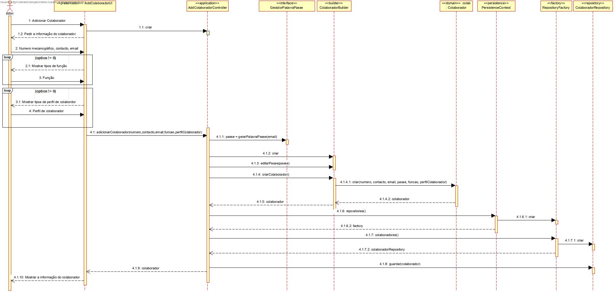
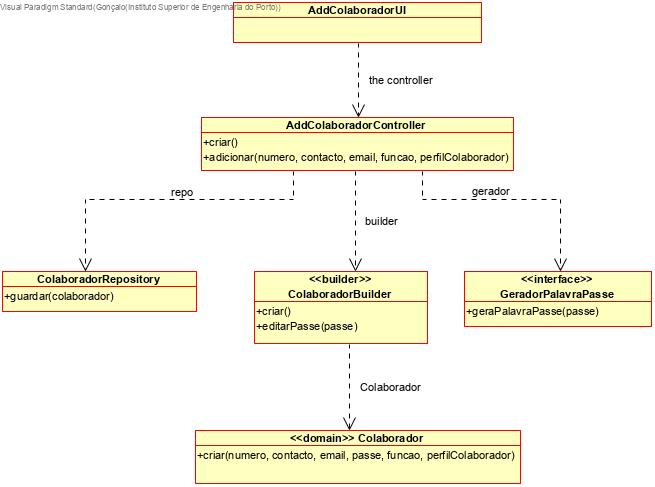

# Adicionar Colaborador
=======================================

# 1. Requisitos

**Demo1**
Como Responsável de Recursos Humanos (RRH), eu pretendo proceder à especificação de um novo colaborador de modo a que este possa, posteriormente, aceder e usar o sistema.

Demo1.1. Adicionar colaborador

Demo1.2. Editar colaborador

Demo1.3. Desativar colaborador

A interpretação feita deste requisito foi no sentido de criar uma forma de carregar para a base de dados a informação dos utilizadores. Para além disso, também é possível editar os seus dados e desativar um colaborador.

# 2. Análise

Enquanto é desenvolvido o programa é de interesse que não se tenha de inserir informação na base de dados de cada vez que o programa precisa ser testado. Sendo assim, faz-se bootstrap de colaboradores de forma a agilizar e a rentabilizar melhor o tempo da equipa no desenvolvimento do software.

# 3. Design

A forma encontrada para resolver este problema foi criar uma classe AdicionarColaboradorUI que faz uso do AdicionarColaboradorController para criar instâncias de forma a garantir as regras de negócio dadas pelo cliente.

## 3.1. Realização da Funcionalidade

## 3.2. Diagrama de Classes

## 3.3. Padrões Aplicados

*Nesta secção deve apresentar e explicar quais e como foram os padrões de design aplicados e as melhores práticas.*

## 3.4. Testes

**Teste 1:** Verificar que não é possível criar uma instância da classe Colaborador com todos os valores nulos.

	@Test(expected = IllegalArgumentException.class)
		public void ensureNullIsNotAllowed() {
		Colaborador instance = new Colaborador(null,null,null,null,null,null,null,null,null,null,null,null);
	}

**Teste 2:** Verificar que não é possível criar uma instância da classe Colaborador com nenhum valor nulos.

	@Test(expected = IllegalArgumentException.class)
		public void ensureNullIsNotAllowed() {
		Colaborador instance=new Colaborador(36,"Bea","Beatriz Lira",new Date(2001/05/18),"Gaia",true,"Ola56789","ui@gmail.com",null,"idk","idk",181823L);
	}

# 4. Implementação

*Nesta secção a equipa deve providenciar, se necessário, algumas evidências de que a implementação está em conformidade com o design efetuado. Para além disso, deve mencionar/descrever a existência de outros ficheiros (e.g. de configuração) relevantes e destacar commits relevantes;*

*Recomenda-se que organize este conteúdo por subsecções.*

# 5. Integração/Demonstração

*Nesta secção a equipa deve descrever os esforços realizados no sentido de integrar a funcionalidade desenvolvida com as restantes funcionalidades do sistema.*

# 6. Observações

*Nesta secção sugere-se que a equipa apresente uma perspetiva critica sobre o trabalho desenvolvido apontando, por exemplo, outras alternativas e ou trabalhos futuros relacionados.*

