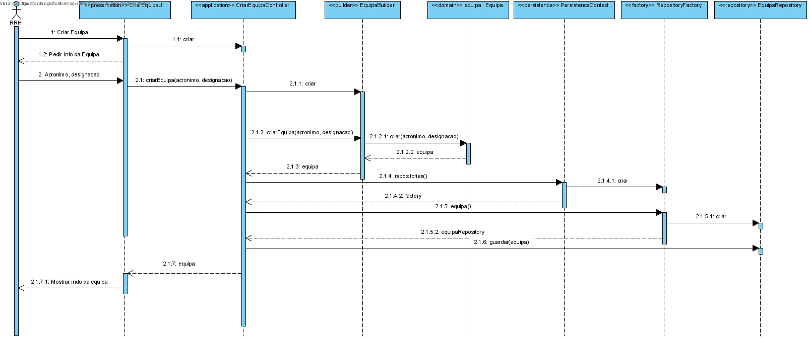
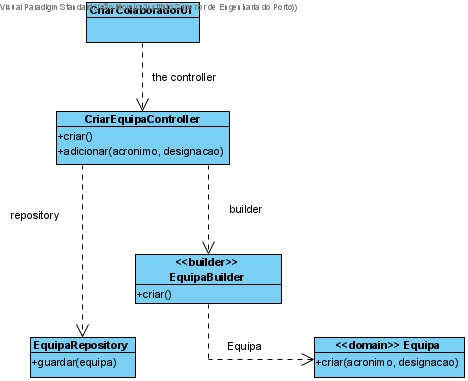

# Criar Equipa
=======================================

# 1. Requisitos
**Demo1** 
Como Responsável de Recursos Humanos (RRH), eu pretendo criar uma nova equipa.

Demo1.1. Criar Equipa

Demo1.2. Editar Equipa

Demo1.3. Remover Equipa

A interpretação feita deste requisito foi no sentido de criar uma forma de carregar para a base de dados a informação das equipas criadas. Para além disso, também é possível editar os seus dados e desativar as mesmas equipas quando estas já não são necessárias.

# 2. Análise

Enquanto é desenvolvido o programa é de interesse que não se tenha de inserir informação na base de dados de cada vez que o programa precisa ser testado. Sendo assim, faz-se bootstrap de equipas de forma a agilizar e a rentabilizar melhor o tempo da equipa no desenvolvimento do software.

# 3. Design

A forma encontrada para resolver este problema foi criar uma classe CriarEquipaUI que faz uso do CriarEquipaController para criar instâncias de forma a garantir as regras de negócio dadas pelo cliente.

## 3.1. Realização da Funcionalidade

## 3.2. Diagrama de Classes

## 3.4. Testes
**Teste 1:** Verificar que não é possível criar uma instância da classe Equipa com todos os valores nulos.

	@Test(expected = IllegalArgumentException.class)
    public void nullEmTodosParametros() {
        Equipa instance = new Equipa(null, null);
    }

**Teste 2:** Verificar que não é possível criar uma instância da classe Equipa com qualquer valor nulo.

@Test(expected = IllegalArgumentException.class)
    public void nullNumParametro() {
        Equipa instance = new Equipa("nao null", null);
        Equipa instance2 = new Equipa(null, "nao null");
    }

# 4. Implementação

# 5. Integração/Demonstração

# 6. Observações

