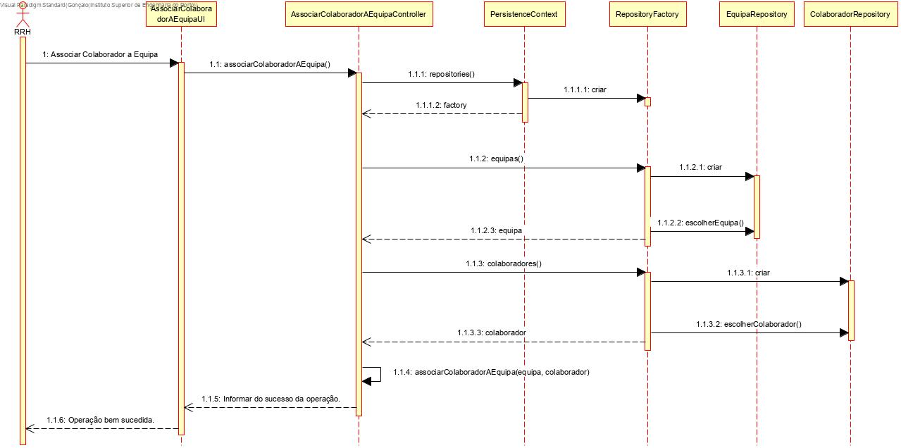
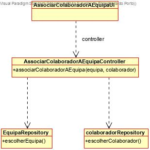

# Associar Colaborador a Equipa
=======================================

# 1. Requisitos

**Demo1**
Como Responsável de Recursos Humanos (RRH), eu pretendo proceder à associação de um colaborador a uma equipa.

Demo1.1. Associar colaborador a equipa

Demo1.2. Remover colaborador de equipa

A interpretação feita deste requisito foi no sentido de criar uma forma de carregar para a base de dados a associação entre um colaborador a uma equipa, de forma a preencher a equipa com os vários colaboradores que a ela pertencem. Para além disso, também é possível remover um colaborador de uma equipa.

# 2. Análise

Enquanto é desenvolvido o programa é de interesse que não se tenha de inserir informação na base de dados de cada vez que o programa precisa ser testado. Sendo assim, faz-se bootstrap de colaboradores e de equipas de forma a agilizar e a rentabilizar melhor o tempo da equipa no desenvolvimento do software.

# 3. Design

A forma encontrada para resolver este problema foi criar uma classe AssociarColaboradorAEquipaUI que faz uso do AssociarColaboradorAEquipaController para criar instâncias de forma a garantir as regras de negócio dadas pelo cliente.

## 3.1. Realização da Funcionalidade

## 3.2. Diagrama de Classes

## 3.4. Testes 

**Teste 1:** Verificar se o colaborador foi associado à equipa.

	@Test
    public void associarColaboradorAEquipa(){
        Equipa equipa1 = new Equipa("kdk", "s");
        Colaborador colab1 = new Colaborador(122, "as", "kmkm", new Date(2001/05/18), "wedd", true,"sriuf8F", "dkdsdf@gmail.com", "oi", "ok", "ok", 91812 );
        AssociarColaboradorAEquipaController acec = new AssociarColaboradorAEquipaController();
        boolean expected = acec.associarColaboradorAEquipa(equipa1, colab1);
        boolean result = false;
        for (Colaborador colab : equipa1.colaboradores()){
            if (colab.equals(colab1)){
                result = true;
                break;
            }
        }
        assertEquals(expected, result);
    }

# 4. Implementação

Nada a declarar

# 5. Integração/Demonstração

Sendo esta a funcionalidade definida com grande prioridade, foi das primeiras a ser implementada, para que, posteriormente, as outras funcionalidades se possam associar a esta.

# 6. Observações

Nada a observar

