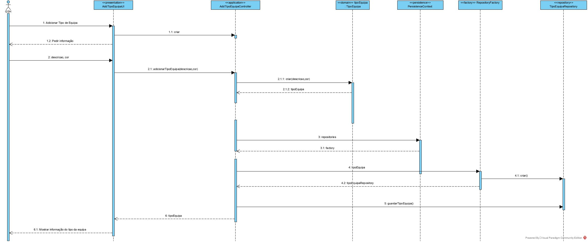
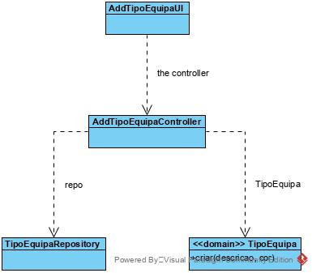

# Adicionar Tipo de Equipa
=======================================

# 1. Requisitos

**Demo1**
Como RRH, eu pretendo registar um novo tipo de equipa.

Demo1.1. Adicionar tipo de equipa

Demo1.2. Editar tipo de equipa

Demo1.3. Remover tipo de equipa

A interpretação feita deste requisito foi no sentido de criar uma forma de carregar para a base de dados a informação dos tipos de equipa. Para além disso, também é possível editar os seus dados e remover um tipo de equipa, bem como consultar a informação sempre que necessário.

# 2. Análise

Enquanto é desenvolvido o programa é de interesse que não se tenha de inserir informação na base de dados de cada vez que o programa precisa ser testado. Sendo assim, faz-se bootstrap de tipo de equipa de forma a agilizar e a rentabilizar melhor o tempo da equipa no desenvolvimento do software.

# 3. Design

A forma encontrada para resolver este problema foi criar uma classe AdicionarTipoEquipaUI que faz uso do AdicionarTipoEquipaController para criar instâncias de forma a garantir as regras de negócio dadas pelo cliente.

## 3.1. Realização da Funcionalidade

## 3.2. Diagrama de Classes

## 3.4. Testes 
*Nesta secção deve sistematizar como os testes foram concebidos para permitir uma correta aferição da satisfação dos requisitos.*

**Teste 1:** Verificar que não é possível criar uma instância da classe TipoEquipa com todos os valores nulos.

	@Test(expected = IllegalArgumentException.class)
		public void ensureNullIsNotAllowed() {
		TipoEquipa instance = new TipoEquipa(null,null);
	}

**Teste 2:** Verificar que não é possível criar uma instância da classe TipoEquipa com nenhum valor nulo.

	@Test(expected = IllegalArgumentException.class)
		public void ensureNullIsNotAllowed() {
		TipoEquipa instance=new TipoEquipa("descricao",null);
	}

# 4. Implementação

Nada a declarar.

# 5. Integração/Demonstração

Esta funcionalidade foi rapidamente desenvolvida de modo a poder eliminar algumas dependecias, como por exemplo na associação de colaborador a uma equipa.

# 6. Observações

Nada a observar.

