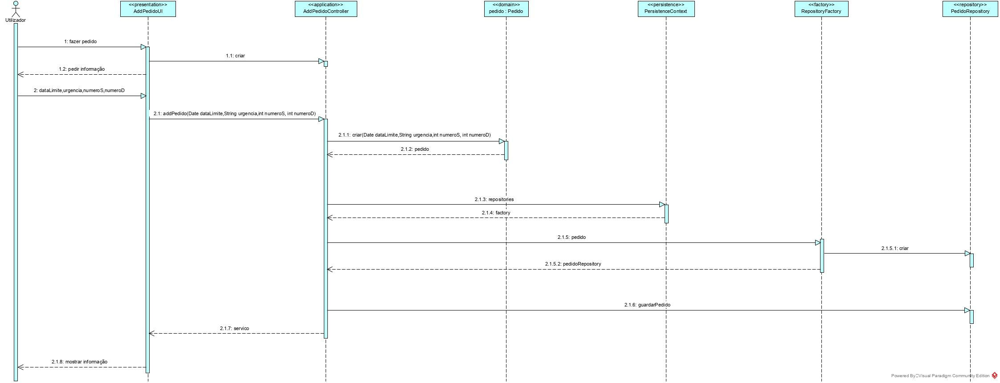
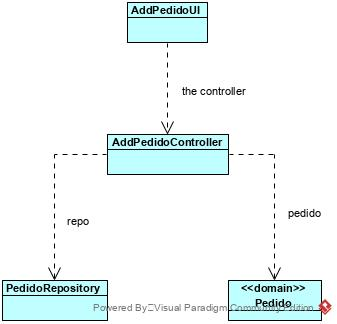

# Solicitar serviço
=======================================

# 1. Requisitos

**Demo1**
Como utilizador, eu pretendo solicitar um serviço do catálogo de serviços que me é disponibilizado.

- Demo1.1. Pretendo iniciar a solicitação de um serviço mas deixá-lo inacabado, de modo a proceder à solicitação do mesmo mais tarde.

- Demo1.2. Pretendo finalizar a solicitação de um serviço já iniciado.

A interpretação feita deste requisito foi no sentido de criar uma forma de carregar para a base de dados a informação dos pedidos, de modo a que estes possam ficar inacabados e completos mais tarde.

# 2. Análise

Para esta funcionalidade vão ser apresentados os serviços a que o colaborador tem acesso para que depois este possa escolher um para realizar um pedido.

# 3. Design

A forma encontrada para resolver este problema foi criar uma classe AdicionarPedidoUI que faz uso do AdicionarPedidoController para iniciar um pedido relativo a um serviço a que o utilizador tenha acesso.

## 3.1. Realização da Funcionalidade

## 3.2. Diagrama de Classes

## 3.3. Padrões Aplicados

*Nesta secção deve apresentar e explicar quais e como foram os padrões de design aplicados e as melhores práticas.*

## 3.4. Testes 
*Nesta secção deve sistematizar como os testes foram concebidos para permitir uma correta aferição da satisfação dos requisitos.*

**Teste 1:** Verificar que não é possível criar uma instância da classe Exemplo com valores nulos.

	@Test(expected = IllegalArgumentException.class)
		public void ensureNullIsNotAllowed() {
		Exemplo instance = new Exemplo(null, null);
	}

# 4. Implementação

*Nesta secção a equipa deve providenciar, se necessário, algumas evidências de que a implementação está em conformidade com o design efetuado. Para além disso, deve mencionar/descrever a existência de outros ficheiros (e.g. de configuração) relevantes e destacar commits relevantes;*

*Recomenda-se que organize este conteúdo por subsecções.*

# 5. Integração/Demonstração

*Nesta secção a equipa deve descrever os esforços realizados no sentido de integrar a funcionalidade desenvolvida com as restantes funcionalidades do sistema.*

# 6. Observações

*Nesta secção sugere-se que a equipa apresente uma perspetiva critica sobre o trabalho desenvolvido apontando, por exemplo, outras alternativas e ou trabalhos futuros relacionados.*

