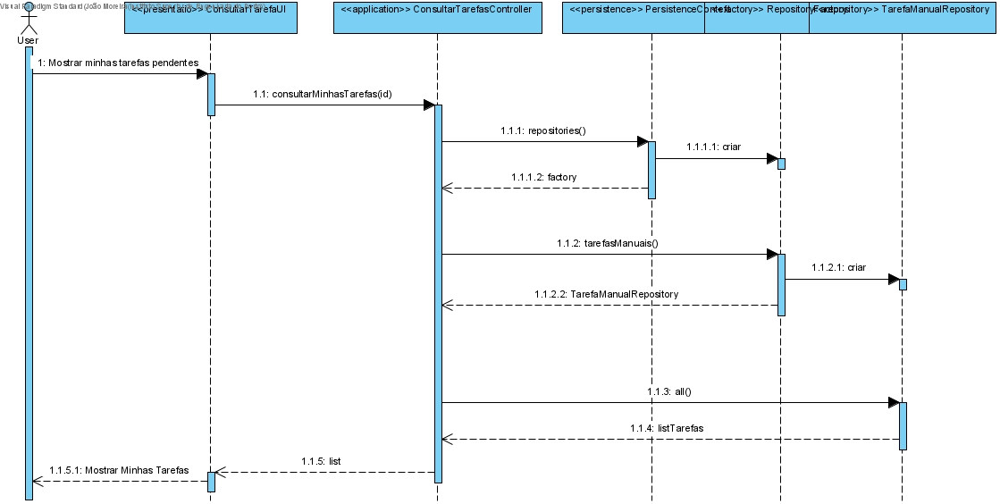
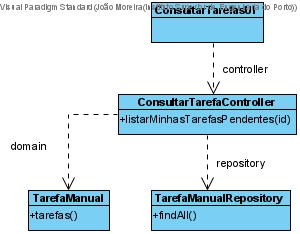

# Consultar Tarefas de um determinado Colaborador
==================================================

# 1. Requisitos

**Demo1**
Como utilizador, eu pretendo consultar as tarefas pendentes que me estão assignadas.

Demo1.1. Consultar Minhas Tarefas Pendentes

A interpretação feita deste requisito foi no sentido de criar uma forma de pesquisar/consultar a informação das tarefas pendentes assignadas a um colaborador através da base de dados.

# 2. Análise

Enquanto é desenvolvido o programa é de interesse que não se tenha de inserir informação na base de dados de cada vez que o programa precisa ser testado. Sendo assim, faz-se bootstrap de tarefas de forma a agilizar e a rentabilizar melhor o tempo da equipa no desenvolvimento do software.

# 3. Design

A forma encontrada para resolver este problema foi criar uma classe ListarCatalogosEServicosUI que faz uso do ListarCatalogosEServicosController para originar listas para apresentar aquando o pedido de consulta, de forma a garantir as regras de negócio dadas pelo cliente.

## 3.1. Realização da Funcionalidade

## 3.2. Diagrama de Classes

