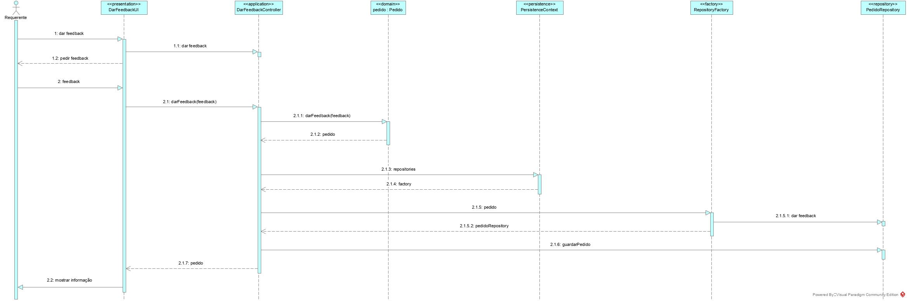
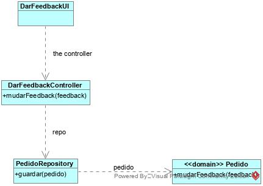

# Transmitir grau de satisfação de um pedido
=======================================

# 1. Requisitos

**Demo1**
Como utilizador, eu pretendo transmitir o meu grau de satisfação sobre a resolução de um dado pedido por mim efetuado.

# 2. Análise

Enquanto é desenvolvido o programa é de interesse que não se tenha de inserir informação na base de dados de cada vez que o programa precisa ser testado. Sendo assim, faz-se bootstrap de tipo de equipa de forma a agilizar e a rentabilizar melhor o tempo da equipa no desenvolvimento do software.

# 3. Design

*Nesta secção a equipa deve descrever o design adotado para satisfazer a funcionalidade. Entre outros, a equipa deve apresentar diagrama(s) de realização da funcionalidade, diagrama(s) de classes, identificação de padrões aplicados e quais foram os principais testes especificados para validar a funcionalidade.*

*Para além das secções sugeridas, podem ser incluídas outras.*

## 3.1. Realização da Funcionalidade

## 3.2. Diagrama de Classes

## 3.4. Testes 

**Teste 1:** Verificar que não é possível dar feedback com valores que não estejam entre 1 e 5

	@Test(expected = IllegalArgumentException.class)
		public void VerificaFeedbackCumpreLimites() {
		
	}

# 4. Implementação

Só se pode dar feedback de um pedido se este não tiver sido finalizado há mais de 7 dias, sendo isto verificado com um select em pedidoRepository.

# 5. Integração/Demonstração

Tem de haver pedidos finalizados para que se possa demonstrar esta US.

# 6. Observações

Nada a declarar
